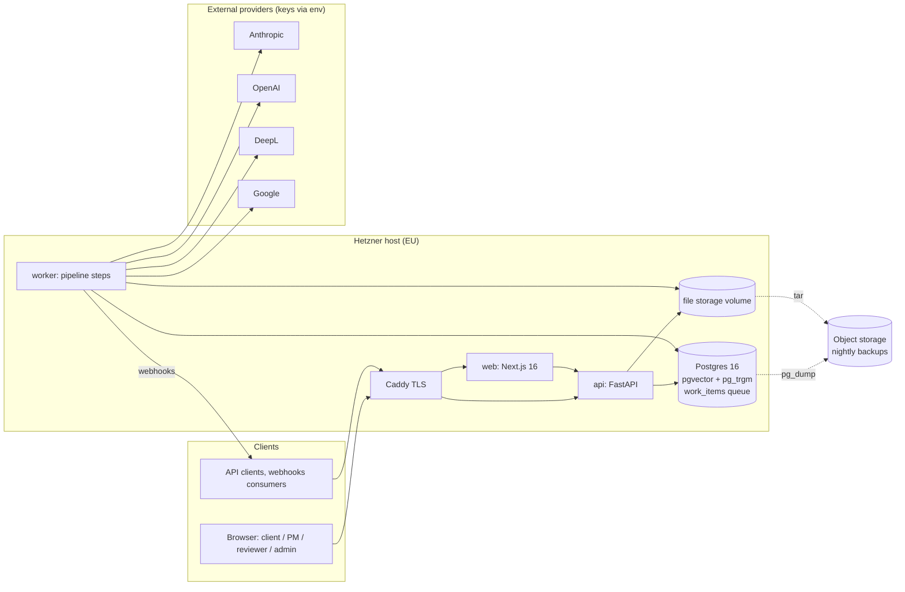
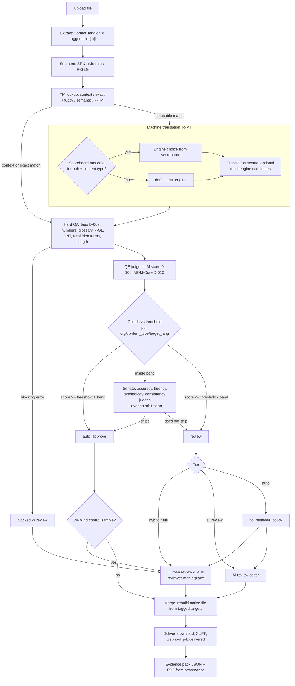

# Arbiter system design

Status: living document. Decisions referenced as D-0NN are in `docs/decisions.md`.

## 1. What the system does

Arbiter takes a customer file, translates it, decides segment by segment whether the translation can ship without a human, routes the rest to the right reviewer (human or AI editor depending on tier), rebuilds the file in its native format, and hands back an evidence pack showing why each segment shipped.

It replaces three separately bought systems:

| Layer | Comparable products | In Arbiter |
|---|---|---|
| Business / PM | Plunet, XTRF | quotes, projects, jobs, usage, invoices, reviewer payouts, ledger |
| CAT / TMS | Trados, Phrase, memoQ, XTM, Crowdin, Lokalise | file formats, segmentation, TM, termbase, MT routing, hard QA, XLIFF export |
| Reviewer marketplace | Smartcat, Gengo | reviewer sign-up, qualification tests, task routing, per-decision pay, disputes |
| Original | (ModelFront, Unbabel do parts of QE) | QE judge + multi-agent senate + calibrated thresholds + evidence |

Service tiers:

| Tier | Who touches a segment | Allowed for regulated verticals |
|---|---|---|
| `auto` | nobody if QE + senate pass, else per `no_reviewer_policy` | no |
| `ai_review` | AI editor on segments below threshold | no |
| `hybrid` | human reviewer on segments below threshold, auto above | yes |
| `full` | human reviewer on every segment | yes |

`no_reviewer_policy` (org setting) when a human is required but none is available: `wait` (job waits), `ai_fallback` (AI editor, disclosed in provenance and evidence), `partial` (deliver approved segments, hold the rest). Never silent substitution (D-012).

## 2. Components

- **api** and **worker** are the same image (D-002). The API never calls a provider on the request path except for cheap synchronous checks; anything slow is a `work_items` row.
- **Postgres** is the only stateful service besides file storage: relational data, TM vectors (pgvector, D-003), fuzzy search (pg_trgm), queue, idempotency records, provenance.
- **Okapi Framework** sidecar is planned for P06 (D-004); until then file handling is pure Python behind `FormatHandler`.

## 3. Pipeline

Every arrow that changes a segment writes a provenance event. Every step is a `work_items` kind (e.g. `job.prepare`, `job.translate`, `job.score`, `job.merge`, `webhook.deliver`), enqueued in the same transaction as the state change that requires it.

Thresholds (D-011): one row per org + content_type + target_lang, starting at `ARBITER_DEFAULT_THRESHOLD`. Calibration moves a threshold by at most 3 points per week, driven by control samples (2% of auto-approved segments, reviewed blind) and reported escaped errors. A safety offset is added while a provider is degraded (runbook).

## 4. Data model overview

| Area | Tables | Notes |
|---|---|---|
| Tenancy | `organizations`, `users`, `api_keys` | org settings: tier default, `no_reviewer_policy`, regulated, vertical, AI subprocessor opt-in, data retention |
| Content | `projects`, `files`, `jobs`, `segments` | one job per target language; segment holds source/target tagged text, origin, engine, tm_match, qe_score, decision |
| Linguistic assets | `tm_entries`, `glossaries`, `terms`, `style_cards`, `term_questions` | terms temporal (`valid_from`/`valid_to`), job freezes glossary version; TM has embedding (pgvector) + trigram index |
| Quality | `thresholds`, `senate_runs`, `engine_scores`, `control_samples`, `escaped_errors`, `quality_metrics` | engine_scores is the scoreboard |
| Reviewers | `reviewer_profiles`, `reviewer_pairs`, `reviewer_tests`, `test_attempts`, `review_tasks`, `reviewer_score_events`, `disputes` | |
| Money | `quotes`, `usage_records`, `invoices`, `payouts`, `ledger_entries` | Decimal everywhere; ledger is double-entry style |
| Integrations | `work_items`, `webhooks`, `webhook_deliveries`, `idempotency_records` | |
| Provenance | `provenance_events` | append-only by trigger (D-015); no FK so history outlives retention deletes |

State machines for segments, jobs, review tasks and payouts are defined only in `arbiter/domain/states.py`.

## 5. Queue design (D-002)

- Table `work_items(kind, payload, status ready|running|done|dead, run_at, attempts, max_attempts, locked_by, locked_until, last_error, idempotency_key unique)`.
- Claim: `SELECT ... WHERE status='ready' AND run_at <= now() ORDER BY run_at FOR UPDATE SKIP LOCKED LIMIT n`, set `running`, `locked_by`, `locked_until`. Multiple workers never take the same row.
- Lease expiry: rows `running` past `locked_until` are returned to `ready` (crashed worker).
- Retry: exponential backoff with jitter via `run_at`; after `max_attempts` the row is `dead` and surfaces on the PM exceptions screen.
- Idempotency: enqueuing a step with an existing `idempotency_key` is a no-op, so retries and double clicks are safe. Handlers must also be idempotent (re-running a step converges to the same state).
- Transactions: "change job state + enqueue next step" commit together. No dual-write to a broker.
- Upgrade path: Temporal if workflows outgrow this (long human waits are already modelled as states, not as sleeping workers).

## 6. Security and tenancy

- Auth: JWT (HS256, `ARBITER_JWT_SECRET`, TTL `ARBITER_JWT_TTL_MINUTES`) for browser sessions; API keys `ak_<prefix>.<secret>` stored as argon2 hash, shown once, scoped (D-014).
- Roles: `admin` (platform operator), `pm`, `client`, `reviewer`. Reviewers have no org; they see only the segment and context of the task they hold, plus the relevant terms.
- Every customer query is filtered by `org_id`; tests cover cross-org access returning 404.
- Webhooks signed: `Arbiter-Signature: t=<unix>,v1=<hmac sha256 of "t.body">`; receivers dedupe on `event_id`.
- POST creates accept `Idempotency-Key` (24 h).
- Files: per-org storage paths, size limits at Caddy and API, format sniffing, XML parsers with entity expansion disabled (lxml `resolve_entities=False`).
- Secrets only via env; Postgres not exposed; only Caddy publishes ports.
- Provider data: orgs that have not opted in to AI subprocessors (`ai_subprocessors_opt_in=false`) are not sent to external LLM providers; the quote shows which tiers are available.

## 7. EU data residency

- Hosting: Hetzner Germany or Finland; database, file storage and backups stay in the EU.
- Subprocessors: external providers (Anthropic, OpenAI, DeepL, Google) receive segment text only for orgs that opted in, and only the minimum context needed. Provider region options are configured where the provider supports EU processing. The subprocessor list is published before public launch.
- Retention: `data_retention_days` per org deletes content (files, segment text, TM if requested); provenance keeps hashes and decisions, not text, after retention.
- Legal review before public launch (DPA template, subprocessor list, reviewer contractor terms).

## 8. Observability

- Structured JSON logs (one line per request and per work item) with `org_id`, `job_id`, `segment_id`, `work_item_id`, `engine`, latency, cost.
- `/healthz` (process) for Docker and Caddy; queue health from `work_items` counts by status and oldest `ready` age.
- Quality signals (in `quality_metrics`, shown on `/quality/dashboard`): auto-approve rate, escaped-error rate vs `ARBITER_ESCAPED_ERROR_TARGET`, control-sample disagreement, drift alarm when the auto rate moves more than `ARBITER_DRIFT_ALARM_RATIO` against its baseline.
- Provider health: error rate and latency per engine; the router skips unhealthy engines and the decide step adds a safety offset (runbook).
- Money signals: per job revenue, cost, margin; payouts failed.
- Error tracking and metrics export (e.g. Sentry, Prometheus) are not wired yet: error tracking and uptime arrive in P02 (staging) and P04 (production).
